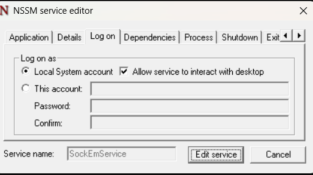

# Using SockEm to monitor Windows Machine

If you want to use SockEm to monitor endpoints, on Windows Machines, you can use *nssm*.

This tutorial will help you setup and connect SockEm into your Indexer ( *OpenSearch* or *ElasticSearch*)

In this example, my system is a x64 bit OS. Thus I used *nssm_64*. You can replace it with *nssm_32* if you're on a 32-bit system.

Download the *EXE* file from the latest release and the *ruleset* into one folder, the tree is going to look like this

```
    SockEm-windows.exe
    ruleset
        example.json
```

NB: You can fetch the default ruleset from the main repository.

And then setup the nssm. If you're on a x64 bit system..
### Install the service 

```ps
& nssm_64.exe install SockEmService "$PWD\SockEm-windows.exe"

```
### Configure environment variables

```ps
$indexerUsername = <your_indexer_username>
$indexerPassword = <your_indexer_password>
$indexerHost = <your_indexer_host>
$indexerPort = <your_indexer_port>
```

### Set environment variables

```ps
& nssm_64.exe set SockEmService AppEnvironmentExtra `
  "INDEXER_USERNAME=$indexerUsername" `
  "INDEXER_PASSWORD=$indexerPassword" `
  "INDEXER_HOST=$indexerHost" `
  "INDEXER_PORT=$indexerPort" `
  "DAEMONIZE=1"
```

### Start the service

```ps
& nssm_64.exe start SockEmService
```

### Optional: Writing stdout and stderr

SockEm outputs to stderr and stdout for debugging. If you wish to check the output logs, be it for troubleshooting or monitoring, you can set the nssm logging file.
This can also be helpful if you don't have an **OpenSearch** or **ElasticSearch** instance set up yet.

```ps
 & nssm_64.exe set SockEmService AppStderr "$PWD\sockem-stderr.logs"

 & nssm_64.exe set SockEmService AppStdout "$PWD\sockem-stdout.logs"
```

**IMPORTANT**: Running within nssm requires you to check the `Allow service to interact with desktop` to see full information of the process

Edit this with

    nssm_64.exe edit SockEmService



Check the box, and you're set.
